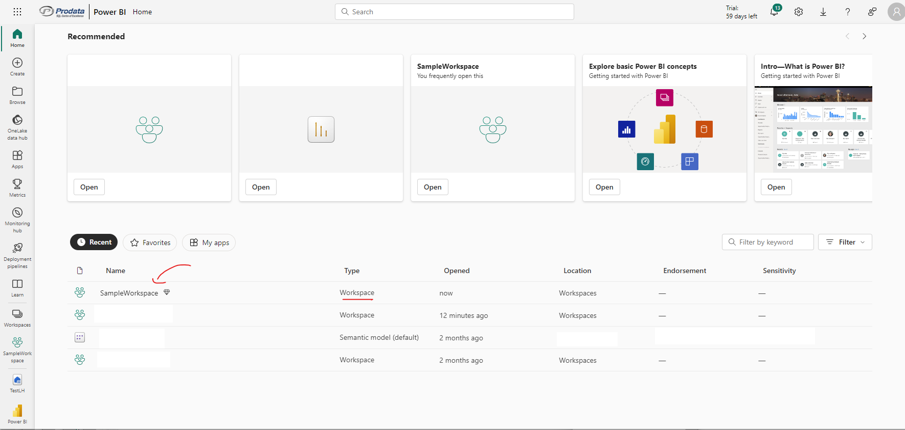
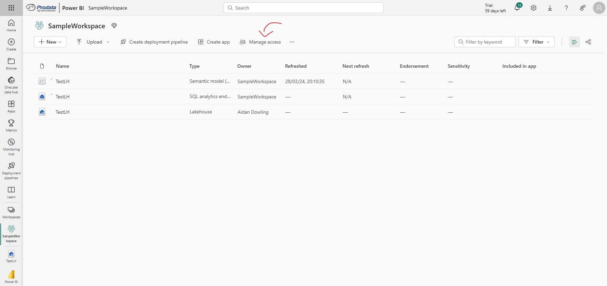
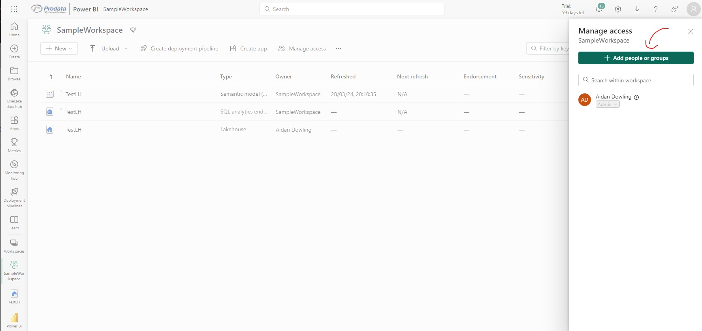
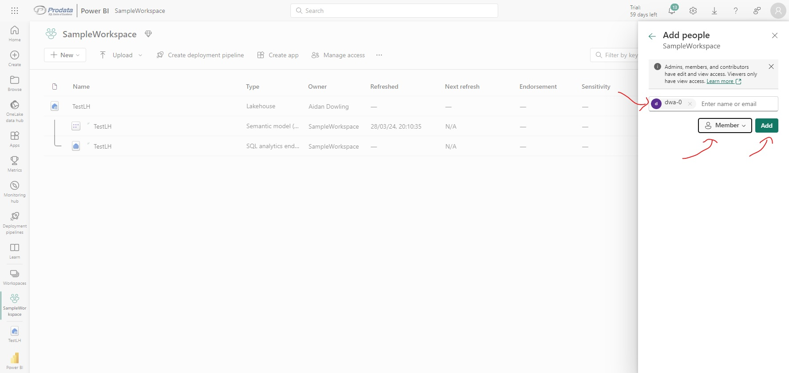

# Granting PowerBI workspace permissions
Small tutorial to grant PowerBI workspace permissions for user / Managed Identity / Service Principle

## Prerequisites
**IF using Managed Identity / Service Principle, a PowerBI admin must follow *[this tutorial](https://dataroots.io/blog/how-to-use-service-principal-authentication-to-access-microsoft-fabrics-onelake)* before beginning.**

## Step 1: Go to [PowerBI](https://app.powerbi.com/)
## Step 2: Select relevant workspace

## Step 3: Select Manage Access

## Step 4: Select Add people or groups 

## Step 5: Select user / service principle name, make member, and select add

You should be good to go from here.